# Clinque

A cross-platform clinic journey and queue-management app. Patients discover a clinic, book, check in, and watch a live queue; nurses drive that same queue from a separate interface. Built with Expo (React Native) and Supabase, with authorization enforced in PostgreSQL rather than in the UI.

**Stack** — Expo SDK 57 · React Native 0.86 · React 19 · TypeScript · Expo Router · Supabase (Auth, PostgreSQL, Realtime, Row Level Security, private Storage)

---

## The problem

An outpatient visit is mostly waiting without information. You do not know how many people are ahead of you, whether you can step out, or when the doctor is actually ready. Clinque puts discovery, booking, arrival, live queue position, consultation status, and after-care in one place — and gives the clinic a matching view so both sides read the same state.

## Two interfaces, one codebase

The same app renders a completely different product depending on who signs in. A nurse never sees booking or a personal journey; a patient never sees the queue board. This is decided by a `clinic_nurses` row, not a client-side flag.

| Patient | Nurse |
|---|---|
| 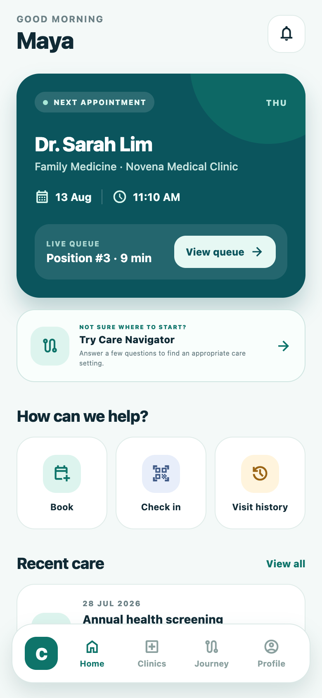 | 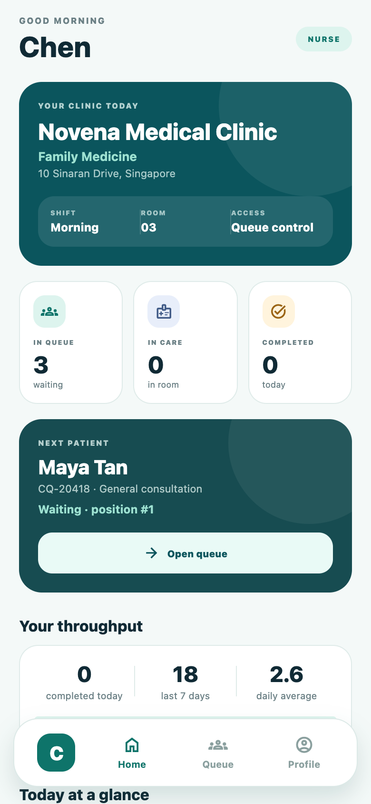 |
| Home · Clinics · Journey · Profile | Home · Queue · Profile |

---

## Product flow

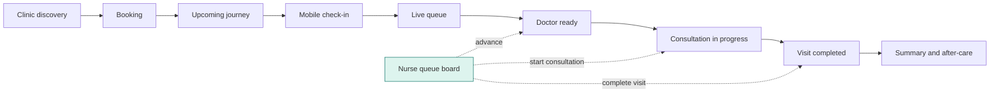

The dotted edges are the point: a patient's screen never advances itself. Every transition originates from an authorized nurse and arrives at the patient over Supabase Realtime.

### Walkthrough

| 1. Sign in | 2. Find a clinic | 3. Journey |
|---|---|---|
| 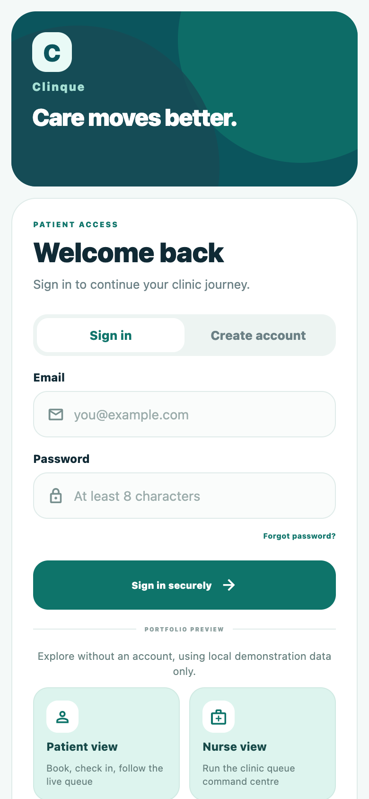 | 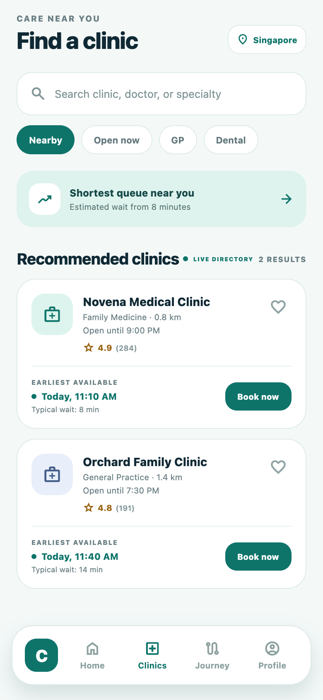 | 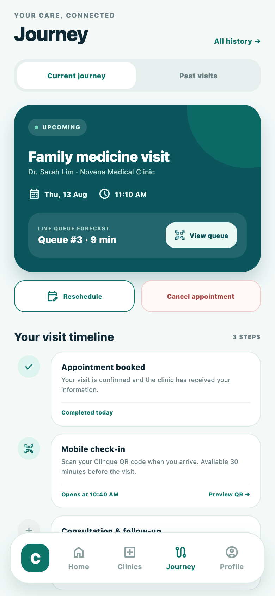 |
| Role is chosen at sign-up. "Explore without an account" opens either interface with local demo data. | Clinic directory reads live from Supabase; falls back to bundled data if the network is unavailable. | Timeline of the visit, with check-in, reschedule and cancel. |

| 4. Live queue | 5. Nurse queue board | 6. Profile |
|---|---|---|
| 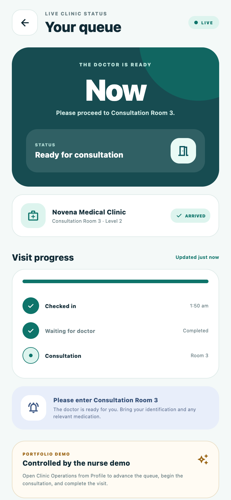 | 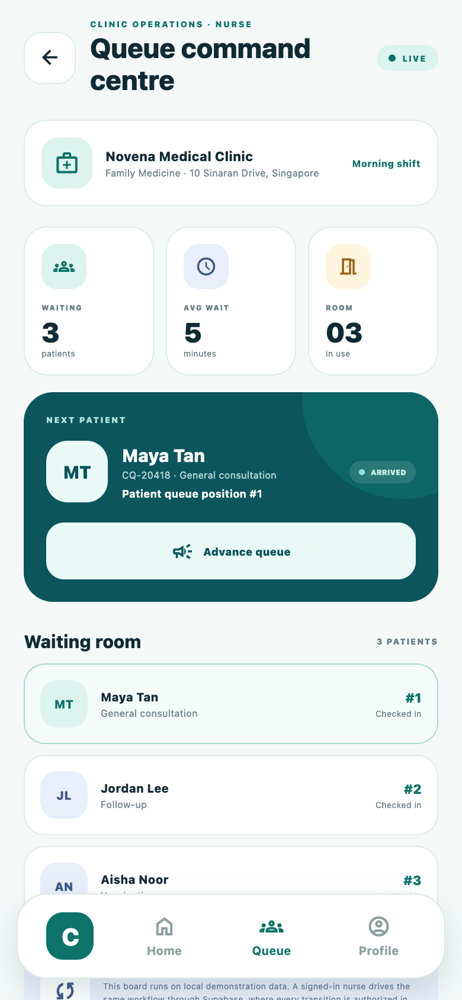 | 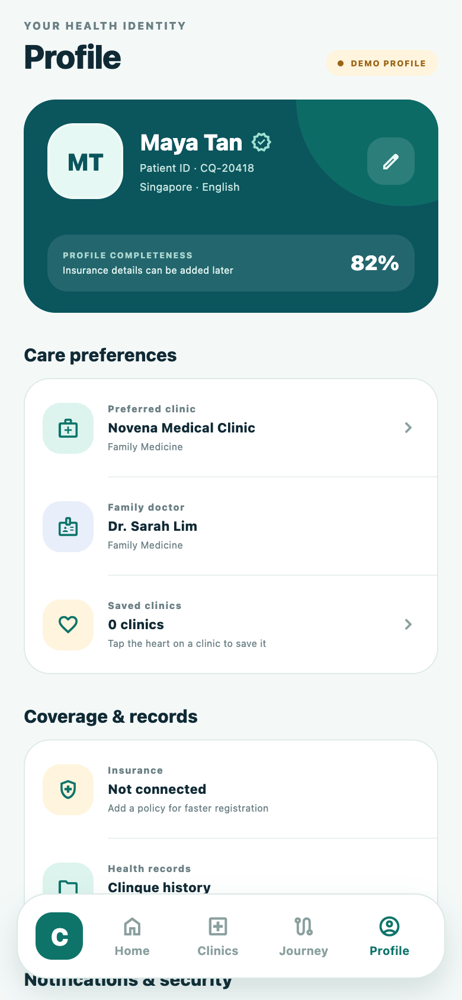 |
| Position, wait estimate, and a state-specific screen for each stage. | Real patients from the nurse's own clinic, with one action per state. | Secure profile with a private avatar, saved clinics, and preferences. |

---

## Architecture

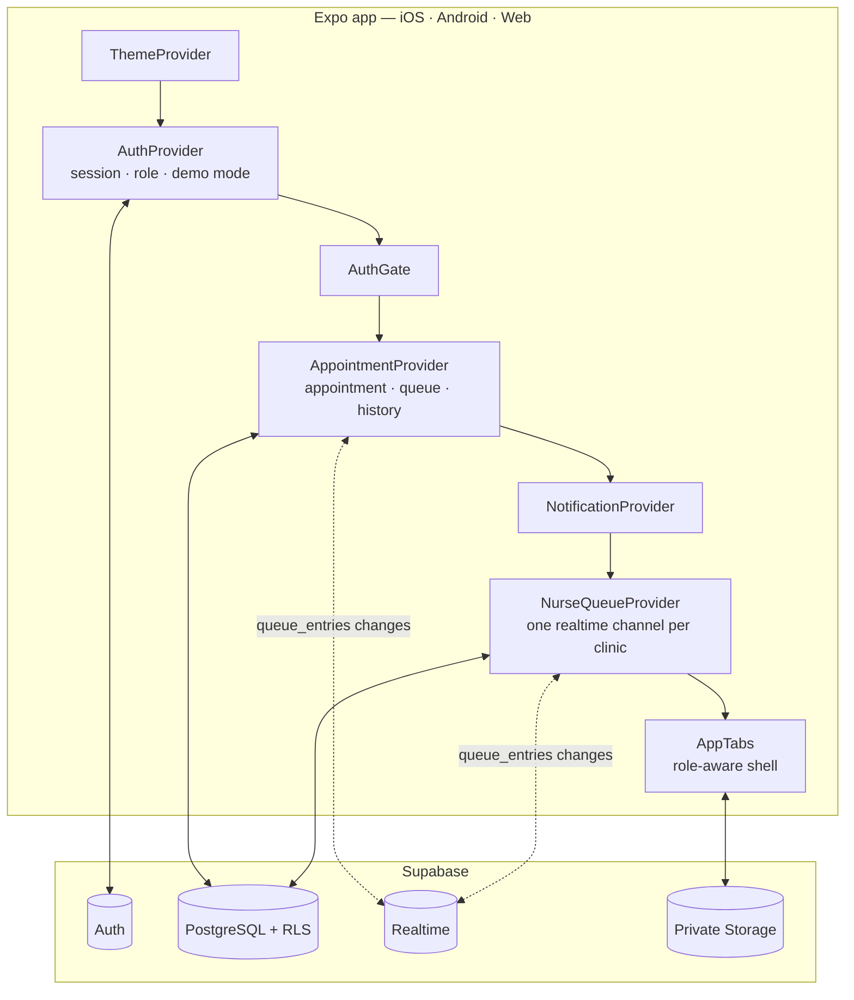

### Provider responsibilities

| Provider | Owns |
|---|---|
| `AuthProvider` | Supabase session, the signed-in profile name, whether the account is a nurse and at which clinic, and demo mode (persisted so a page reload does not eject a demo visitor). |
| `AppointmentProvider` | The patient's current appointment, queue state and visit history. Writes to Supabase when authenticated, AsyncStorage otherwise. Subscribes to `queue_entries` filtered to the signed-in patient. |
| `NurseQueueProvider` | One clinic's live queue and the three transitions. Deliberately a single owner: two screens each opening their own channel on the same topic caused Supabase to throw, because `supabase.channel()` returns an existing channel and listeners cannot be added after `subscribe()`. |
| `NotificationProvider` | Queue alerts (doctor-ready, two-away) and read state. |

---

## Data model

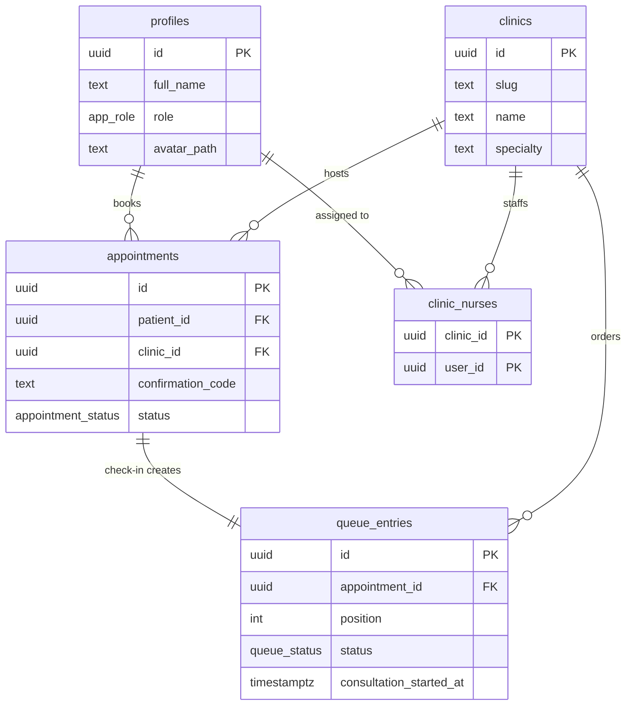

## The queue lifecycle

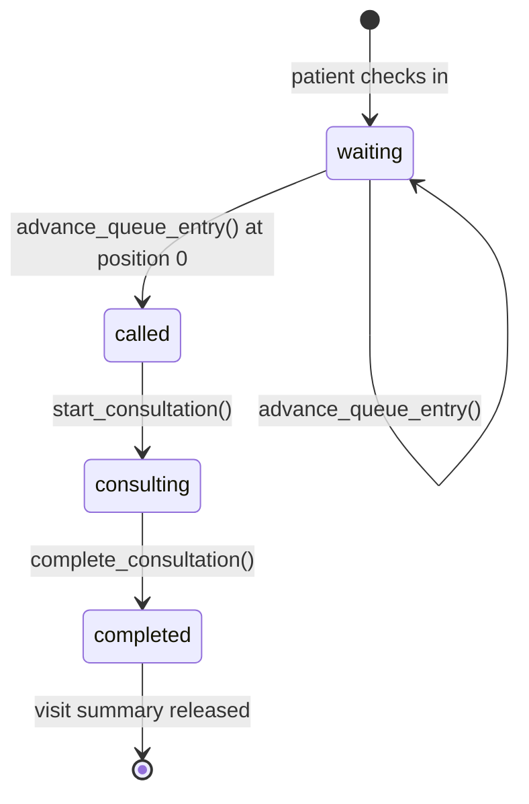

Each transition is a `SECURITY DEFINER` function that verifies nurse membership, checks the source state, and updates `queue_entries` **and** `appointments` in one statement.

That atomicity matters. An earlier version issued two separate client updates. Patients have no `UPDATE` policy on `queue_entries`, so RLS matched zero rows — and PostgREST returns **no error** for an update that matches nothing. The guard never fired, the second update to `appointments` succeeded, and the two tables silently drifted apart. Moving both writes into one function removed the failure mode instead of patching it.

---

## Security model

Authorization lives in the database. Hiding a button is presentation, not protection.

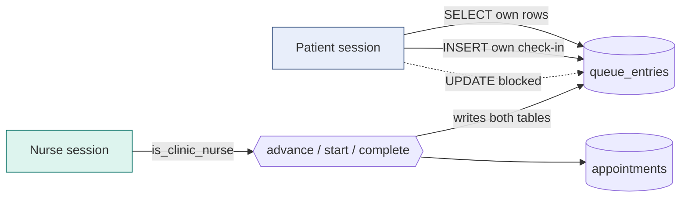

Invariants the schema enforces:

- A patient reads and manages only their own records, and may check themselves in — but cannot advance queue state.
- A patient may set their appointment only to `booked`, `checked_in`, or `cancelled`. The statuses that belong to a clinician are unreachable from a patient session.
- Queue advancement, consultation start, and completion require a `clinic_nurses` row for that clinic. An unauthorized caller receives `42501`, not a silent no-op.
- Avatars live in a private bucket under `avatars/<auth-user-id>/…`, reachable only through signed URLs.
- The client uses the publishable key only. No service-role key ever reaches the app.

### Key database functions

| Function | Purpose |
|---|---|
| `is_clinic_nurse(clinic_id)` | Membership check used by every policy and transition. `SECURITY DEFINER` so it can read `clinic_nurses` without widening the caller's own read access. |
| `advance_queue_entry(appointment_id)` | Decrements position; flips to `called` at zero and stamps `called_at`. |
| `start_consultation(appointment_id)` | `called → consulting`, stamps `consultation_started_at`. |
| `complete_consultation(appointment_id)` | `consulting → completed`; the visit summary is released to the patient. |
| `register_as_nurse(clinic_id)` | Self-service sign-up path. Acts only on the caller. **See the note below.** |
| `promote_to_nurse(email, clinic_slug)` | SQL Editor / service-role only, for provisioning an account manually. |

> **Deliberate tradeoff.** `register_as_nurse` lets any authenticated account claim a nurse role at any active clinic, because the sign-up form is open for portfolio purposes. It is the single choke point for that privilege: replacing its body with an invite code or an approval queue locks the system down without changing a line of client code.

---

## Getting started

```bash
git clone https://github.com/HninPhyuPhyuAye/clinque.git
cd clinque
npm install
cp .env.example .env.local   # then fill in your Supabase project values
npx expo start --web
```

Open `http://localhost:8081`. To try it on a phone on the same Wi-Fi, use your machine's LAN address (`ipconfig getifaddr en0` on macOS) — for example `http://192.168.1.20:8081` — and add that origin to **Supabase → Authentication → URL Configuration**, both as the Site URL and in Redirect URLs. Confirmation and recovery links are sent to whichever origin you signed up from, so `localhost` links will not open on a phone.

### Database setup

Run the migrations in order in the Supabase SQL Editor:

| Migration | Adds |
|---|---|
| `202608120001_initial_backend.sql` | Core tables, roles, RLS policies, realtime publication, seed clinics |
| `202608130001_private_profile_avatars.sql` | `avatar_path`, private `avatars` bucket, per-user storage policies |
| `202608130002_consultation_lifecycle.sql` | `consulting` state and `consultation_started_at` |
| `202608130003_clinic_staff_operations.sql` | Transition functions, tightened patient policy, provisioning |
| `202608130004_nurse_role.sql` | Renames the role to *nurse*, adds self-service registration |

Then create an account through the app and, if you want to assign it manually:

```sql
select public.promote_to_nurse('nurse@example.com', 'novena-medical');
```

### Try it without a backend

The sign-in screen offers **Patient view** and **Nurse view** under *Portfolio preview*. Both run entirely on local demonstration data — no account, no database — including the full queue lifecycle on the nurse board.

---

## Project structure

```
src/
  app/                     Expo Router routes
  components/              app-tabs (role-aware shell, native + web)
  features/
    appointments/          appointment + queue state, realtime, persistence
    auth/                  provider, gate, sign-up roles, reset + verify email
    care-navigator/        guided triage
    clinics/               discovery, booking flow, saved clinics
    journey/               timeline, check-in, history, after-care
    notifications/         queue alerts
    operations/            nurse dashboard, queue board, nurse queue provider
    profile/               secure profile, private avatar, preferences
    queue/                 patient live queue
  lib/supabase.ts          client configuration
supabase/migrations/       version-controlled schema
docs/screenshots/          images used in this README
```

---

## Engineering notes

A few decisions worth explaining:

**Realtime over polling.** The patient queue subscribes to `queue_entries` changes rather than polling. Channel topics carry a per-subscription suffix because `removeChannel` is asynchronous — without it, a fast re-subscribe can be handed a channel that is still tearing down, and adding a listener to it throws.

**Refetch, not patch.** The nurse board refetches on a realtime event instead of merging the payload. The realtime row carries no embedded patient or appointment fields, so patching would blank the names.

**Errors are surfaced, not swallowed.** `supabase-js` resolves `{ data, error }` with a plain object rather than a thrown `PostgrestError`, so an `instanceof Error` check silently discards the real message. The operations screen reads the message off whatever shape arrives and translates known codes into plain language.

**Detail screens stay inside the navigator.** The queue screen hides the tab bar but is still rendered by the router. Returning it from above the navigator unmounted the navigator mid-navigation, which made `router.push('/queue')` a no-op from some screens.

---

## Known limitations

Stated plainly rather than left to be discovered:

- **Native builds are unverified.** The web build runs and has been tested on iOS Safari and Android Chrome. No iOS or Android native build has been produced — Xcode is not installed on the development machine, and the installed Expo Go does not accept an SDK 57 project. The native tab shell has never been executed.
- **No automated test suite.** Validation is TypeScript, Expo Doctor, and manual flows.
- **Visit history is device-local.** `visitHistory` persists to AsyncStorage even for authenticated users, so completed visits do not follow an account across devices. A `visits` table is the natural next step.
- **Some clinic detail is presentational.** Room number, shift, and doctor assignment are fixed values rather than scheduled data.
- **Nurse sign-up is self-service.** See the tradeoff note above.
- **No deployment yet.** There is no public URL; the app runs from a local Expo dev server.

## Licence

[MIT](LICENSE)
